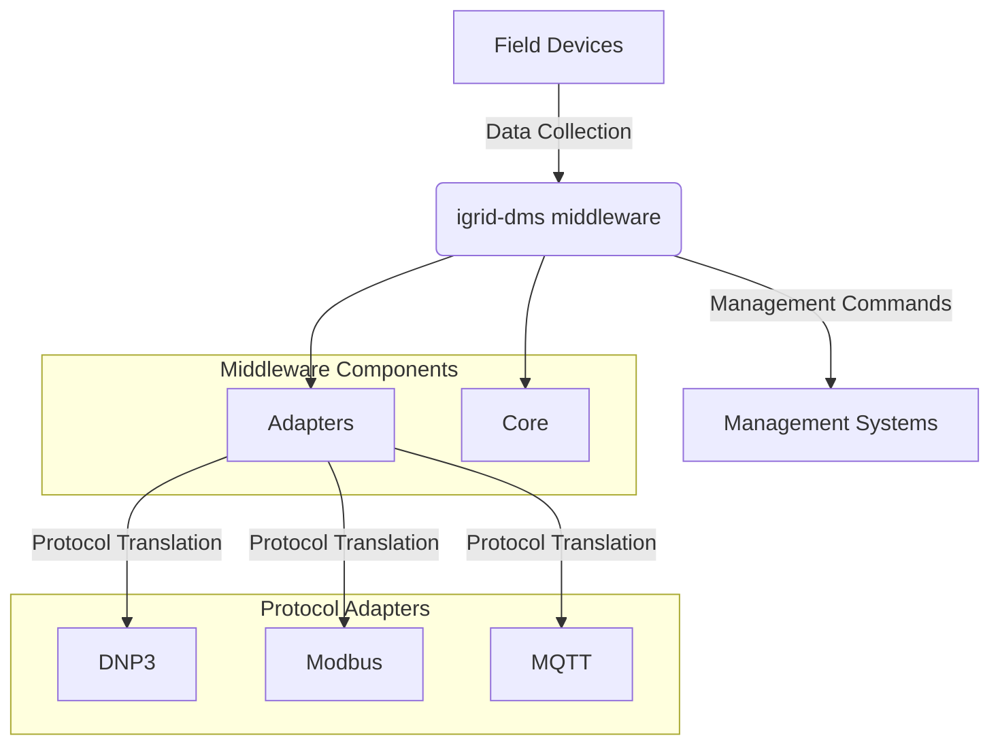

# igrid-dms-middleware-com

## Overview

This middleware and communication infrastructure facilitates seamless integration between various components of Smart Grid Distribution Management Systems. It normalizes, validates, and routes messages between different protocols commonly used in power distribution systems.

## Features

- **Multi-protocol Support**: Handles DNP3, Modbus, MQTT, and HTTP protocols  
- **Protocol Translation**: Converts between different protocol formats transparently  
- **Message Normalization**: Transforms protocol-specific data into a standardized format  
- **Schema Validation**: Ensures data integrity through JSON schema validation  
- **Flexible Routing**: Routes messages to appropriate destination systems  
- **Modbus Server**: Can act as both client (polling) and server (receiving) for Modbus communications  
- **Scalable Architecture**: Easily extensible to support additional protocols  


## Architecture Diagram

Below is a high-level diagram illustrating the middleware infrastructure and protocol adapters:


A more abstracted view of the architecture is as follows:




This diagram represents a more conceptual view, focusing on the flow of data and commands between field devices, the middleware, and management systems, along with the internal components of the middleware.

## Key Features

- **Seamless Integration:** Effortlessly connects iGrid DMS with third-party applications, databases, and services.
- **Modular Architecture:** Easily extend or customize functionality through well-defined modules and plugins.
- **Event-Driven Processing:** Supports real-time event handling and message routing.
- **Secure Communication:** Implements authentication, authorization, and encryption best practices.
- **Flexible Configuration:** Environment-based configuration for different deployment scenarios.
- **Comprehensive Logging:** Built-in logging and monitoring for troubleshooting and analytics.

## Typical Use Cases

- Integrating iGrid DMS with SCADA, GIS, or ERP systems.
- Automating workflows and data synchronization between grid components.
- Real-time monitoring and alerting for grid events.
- Custom protocol translation and data transformation.

## Components


- **Core:** Contains the router, normalizer, and validator
- **Adapters:** Protocol-specific handlers for DNP3, Modbus, MQTT, and HTTP
- **Models:** Message definitions and data structures
- **Config:** Configuration handling for all components


## Prerequisites

- [Go](https://golang.org/) (version 1.18 or higher)
- Access to an iGrid DMS instance or API

## Installation

1. **Clone the repository:**
    ```bash
    git clone https://github.com/your-org/igrid-dms-middleware-com.git
    ```
2. **Build the project:**
    ```bash
    cd igrid-dms-middleware-com
    go build -o igrid-dms-middleware-com
    ```


## Configuration


# configs/gateway.yaml
```yaml

logging:
  level: "info"

mqtt:
  broker_url: "tcp://localhost:1883"
  client_id: "igrid-middleware"
  topic_prefix: "igrid"

modbus:
  address: ":502"
  poll_interval: 5s
  registers:
    - name: "voltage"
      address: 100
      quantity: 1

dnp3:
  dss_endpoint: "http://localhost:8000/api/dnp3"

normalization:
  modbus:
    source_field: "register_value"
    target_field: "value"
  dnp3:
    source_field: "point_value"
    target_field: "value"

schema_path: "configs/message_schema.json"
```

## Usage

Start the middleware service:

```bash
./igrid-dms-middleware-com
```
# Basic startup
./igrid-middleware

# Start with Modbus server capability
./igrid-middleware --modbus-server

The middleware will initialize, connect to the configured iGrid DMS instance, and begin processing events and requests.

## Message Flow

1. Data is collected from field devices via Modbus/DNP3  
2. Messages are normalized to a common format  
3. Messages are validated against the defined schema  
4. Valid messages are routed to appropriate destinations (MQTT/HTTP)  

---

## Protocol Support

### Modbus
- **Client mode**: Polls Modbus TCP devices at configured intervals  
- **Server mode**: Accepts incoming Modbus TCP connections (with `--modbus-server` flag)  
- **Register mapping**: Configure in `gateway.yaml`  

### DNP3
- **Outstation support**: Handles DNP3 data points  
- **Integration with DSS** (Distribution System Simulator)  

### MQTT
- **Publishing**: Sends normalized data to configured MQTT topics  
- **Quality of Service options**: QoS 0, 1, 2  
- **TLS support** for secure connections  

---

## API Documentation

### HTTP Endpoints
- `/api/v1/data` – POST endpoint for submitting data  
- `/api/v1/status` – GET endpoint for service status  


```json
{
  "timestamp": "2023-07-20T15:04:05Z",
  "deviceId": "device-001",
  "protocol": "modbus",
  "value": 120.5,
  "unit": "V",
  "quality": "GOOD"
}
```

## Support

For questions, bug reports, or feature requests, please open an issue on the [GitHub repository](https://github.com/your-org/igrid-dms-middleware-com/issues).

## Contributing

Contributions are welcome! Please review the [contribution guidelines](CONTRIBUTING.md) before submitting pull requests.

## License

This project is licensed under the MIT License. See the [LICENSE](LICENSE) file for details.
