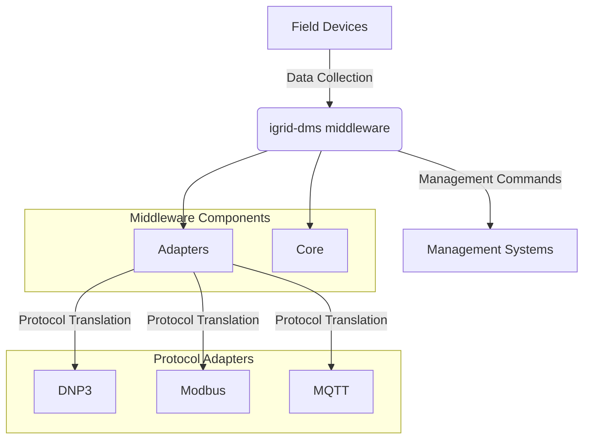

# igrid-dms-middleware-com

A middleware component for the iGrid DMS system, written in Go, designed to streamline communication and integration between distributed modules and external applications.

## Overview

`igrid-dms-middleware-com` serves as a bridge between the iGrid Distribution Management System (DMS) and other enterprise systems or services. Built with Go for performance and reliability, it provides a robust, scalable, and secure way to manage data exchange, event handling, and process orchestration within smart grid environments.

## Architecture Diagram

Below is a high-level diagram illustrating the middleware infrastructure and protocol adapters:


A more abstracted view of the architecture is as follows:



This diagram represents a more conceptual view, focusing on the flow of data and commands between field devices, the middleware, and management systems, along with the internal components of the middleware.

## Key Features

- **Seamless Integration:** Effortlessly connects iGrid DMS with third-party applications, databases, and services.
- **Modular Architecture:** Easily extend or customize functionality through well-defined modules and plugins.
- **Event-Driven Processing:** Supports real-time event handling and message routing.
- **Secure Communication:** Implements authentication, authorization, and encryption best practices.
- **Flexible Configuration:** Environment-based configuration for different deployment scenarios.
- **Comprehensive Logging:** Built-in logging and monitoring for troubleshooting and analytics.

## Typical Use Cases

- Integrating iGrid DMS with SCADA, GIS, or ERP systems.
- Automating workflows and data synchronization between grid components.
- Real-time monitoring and alerting for grid events.
- Custom protocol translation and data transformation.

## Prerequisites

- [Go](https://golang.org/) (version 1.18 or higher)
- Access to an iGrid DMS instance or API

## Installation

1. **Clone the repository:**
    ```bash
    git clone https://github.com/your-org/igrid-dms-middleware-com.git
    ```
2. **Build the project:**
    ```bash
    cd igrid-dms-middleware-com
    go build -o igrid-dms-middleware-com
    ```
3. **Configure environment variables:**  
   Copy `.env.example` to `.env` and update the values as needed for your environment.

## Configuration

All configuration is managed via environment variables. Key settings include:

- `IGRID_DMS_API_URL`: Base URL for the iGrid DMS API.
- `MIDDLEWARE_PORT`: Port on which the middleware will run.
- `LOG_LEVEL`: Logging verbosity (e.g., info, debug, error).

Refer to the `.env.example` file for a full list of configurable options.

# configs/gateway.yaml
logging:
  level: "info"

mqtt:
  broker_url: "tcp://localhost:1883"
  client_id: "igrid-middleware"
  topic_prefix: "igrid"

modbus:
  address: ":502"
  poll_interval: 5s
  registers:
    - name: "voltage"
      address: 100
      quantity: 1

dnp3:
  dss_endpoint: "http://localhost:8000/api/dnp3"

normalization:
  modbus:
    source_field: "register_value"
    target_field: "value"
  dnp3:
    source_field: "point_value"
    target_field: "value"

schema_path: "configs/message_schema.json"

## Usage

Start the middleware service:

```bash
./igrid-dms-middleware-com
```
# Basic startup
./igrid-middleware

# Start with Modbus server capability
./igrid-middleware --modbus-server

The middleware will initialize, connect to the configured iGrid DMS instance, and begin processing events and requests.

## Support

For questions, bug reports, or feature requests, please open an issue on the [GitHub repository](https://github.com/your-org/igrid-dms-middleware-com/issues).

## Contributing

Contributions are welcome! Please review the [contribution guidelines](CONTRIBUTING.md) before submitting pull requests.

## License

This project is licensed under the MIT License. See the [LICENSE](LICENSE) file for details.
